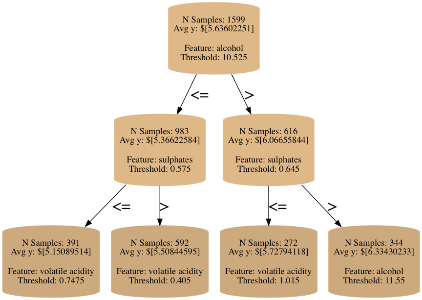
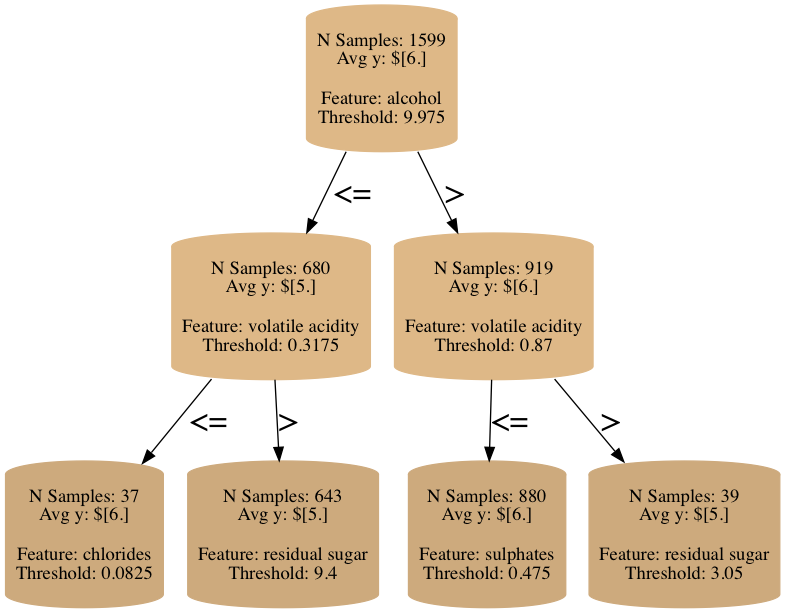

# pyboretum
[](https://circleci.com/gh/picwell/pyboretum/tree/master)

Fertile grounds to explore and analyze custom decision trees in Python

## Overview

[TODO] ADD REFERENCES FOR CLARIFICATION AND JUSTIFICATION

Decision trees, also known as recursive partitioning, are one of the most often used statistical/machine learning algorithms in practice, often as part of a random forest. They have gained wide popularity by offering robust performance over a wide range of regression and classification problems with little tuning of the hyperparameters. As a result, there are many implementations of decision tree algorithms in various programming languages, such as, `scikit-learn` in Python and `rpart` in R.

Although decision trees offer good performance out of the box, they are, in fact, a framework to create various different algorithms. The framework consists of a few distinct elements: (a) rules to identify cut variable; (b) rules to identify cut point; (c) rules to stop or prune; and (d) models to predict from nodes/partitions. There are numerous publications that change these elements to create decision trees tailored to problems of interest. However, `scikit-learn`, the most popular decision tree implementation in Python, does not provide ways to customize the basic algorithm it offers. 
   
_pyboretum_ solves this problem by offering an object-oriented programming framework to create your own decision tree algorithm and tools to analyze it in Python. Similar packages exist in other languages, for instance, like `partykit` in R. Such a custom algorithm can significantly improve how efficiently training data are used and lead to improved performance; further performance improvements can be also achieved by popular ensemble techniques like random forest or boosting.

The code currently focuses on regression problems, and we may support classification problems in the future as well (we are open to contributions!). Note that the code base is under active development, and the class interface is still evolving. It is licensed under the MIT License (see [license file](LICENSE) for more information) and supports both Python 2.7 and 3.7.

## Installation

In the directory where you want to keep the _pyboretum_ source code,
```
git clone git@github.com:picwell/pyboretum.git
cd pyboretum
python setup.py install
```
This will make _pyboretum_ available through `import`.

## Getting Started

In this example, we will use a small public dataset of red wine quality to demonstrate the basic pattern of training and inspecting a _pyboretum_ decision tree. The key takeaways are
* `Splitter` class can be customized to change the variable and cut-point selection rules. The example shows `MSESplitter` and `MAESplitter` that optimize for the weighted mean squared error (MSE) and mean absolute error (MAE), respectively.
* `Node` class can be customized to provide different predictions. The example shows `MeanNode` for MSE criterion and `MedianNode` for the MAE criterion.
* `.visualize_tree()` creates a nice visualization of the decision rules

[NOTE] DO YOU WANT TO INCLUDE THE VISUALIZATION CODE FOR PARTITIONS?

```python
from pyboretum import DecisionTree, MeanNode

dt = DecisionTree(min_samples_leaf=5, max_depth=5,
				  node_class=MeanNode)
```

### Training a Decision Tree
Currently, _pyboretum_ trees expect the data to be numeric (continuous or ordered categorical), so you have to encode your nominal categorical variables using algorithms like one-hot coding. We plan to support nominal categorical features in the future.

#### Specifying a Splitter
When we fit a tree, we specify a `Splitter` object to `.fit()` in addition to passing `X` and `Y` ("features" and "target" data, respectively). This defaults to `MSESplitter` if not given. Each `Splitter` will partition the data to optimize a different split criteria, and this is where users can create their own custom `Splitter` classes tailored to a particular problem at hand.

In the cells below, we will generate two different trees to minimize MSE and MAE using two different `Splitter`s included out-of-the-box in _pyboretum_.

```python
import pandas as pd
data = pd.read_csv('http://archive.ics.uci.edu/ml/machine-learning-databases/wine-quality/winequality-red.csv', sep=';')
y = data['quality']
X[c for c in X.columns if c!='quality']

dt.fit(X, y, splitters.MSESplitter())
dt.visualize_tree(max_depth=2)
```


We can pass a different `Splitter` object to `.fit()` to generate an alternative tree.

```python
from pyboretum import MedianNode

dt = DecisionTree(min_samples_leaf=5, max_depth=5,
				  node_class=MedianNode)
                  
dt.fit(X, y, splitters.MAESplitter())
dt.visualize_tree(max_depth=2)
```




## Key Features

* Support for univariate (vector `y`) and multivariate (matrix `Y`) MSE criteria for variable and cut-point selection
* Support for univariate MAE criteria for variable and cut-point selection
* Support for Mahalanobis distance for multivariate MSE criteria
* Visualization of decision rules

## Code Organization

```
<root_dir>/
  pyboretum/
   |-- splitters/
   |    |-- base.py (interface definition for Splitter)
   |    |-- mae_splitter.py (splitter for MAE criteria)
   |    |-- mse_splitter.py (splitter for MSE criteria, including using mahalanobis distance)
   |-- tree/
   |    |-- base.py (interface for Tree)
   |    |-- linked_tree.py (Tree implementation using linked lists)
   |    |-- list_tree.py (Tree implemenataion using lists)
   |-- decision_tree.py (main decidion tree implementation)
   |-- node.py (Node classes used with Tree)
   |-- training_data.py 
   |-- utils.py
  test/  (various unit tests)
```

## Key Classes/Interfaces for Customization

## What to Come Next

## Release Notes

## References
