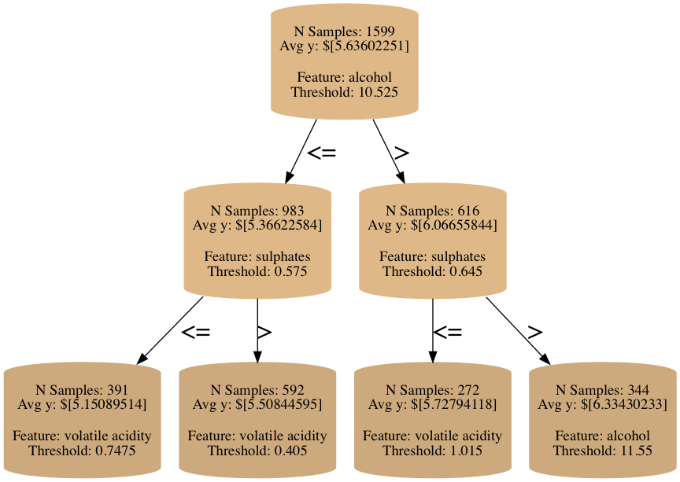
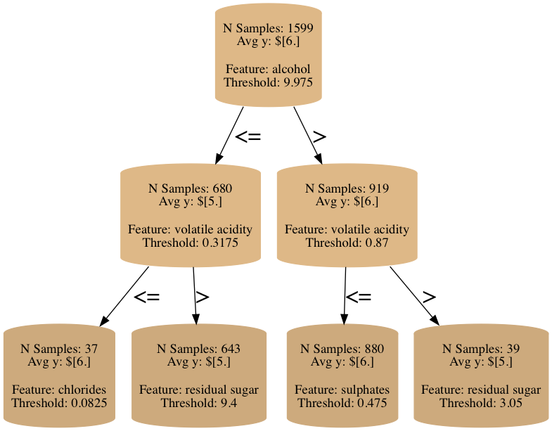

# pyboretum

### Instantiating a Decision Tree
We currently support a couple common tree parameters including `min_samples_leaf` and `max_depth`, which are declared at tree instantiation.  Additionally, we also specify the *node type*, which declares what data to calculate and store at each node (defaults to `MeanNode`).

In this vignette, we'll use a small dataset of red wine quality to demonstrate the basic pattern of training and inspecting decision tree.

```python
from pyboretum import DecisionTree, MeanNode

dt = DecisionTree(min_samples_leaf=5, max_depth=5,
				  node_class=MeanNode)
```

### Training a Decision Tree
Currently, pyboretum trees expect the data to be integer- or real-valued (with plans to support string-encoded categorical features).

#### Specifying a Splitter
When we fit a tree, in addition to passing `X` and `y` (our "features" and "target" data, respectively), we also specify a splitter (defaults to `MSESplitter`).  Each splitter will partition the data to optimize a different objective, and this is where users can create their own custom splitters tailored to a particular problem at hand.

In the cells below, we will generate two different trees to minimize *mean squared error* and *mean absolute error*, two different splitters that are included out-of-the-box in pyboretum.

```python
import pandas as pd
data = pd.read_csv('http://archive.ics.uci.edu/ml/machine-learning-databases/wine-quality/winequality-red.csv', sep=';')
y = data['quality']
X[c for c in X.columns if c!='quality']

dt.fit(X, y, splitters.MSESplitter())
dt.visualize_tree(max_depth=2)
```


We can pass a different splitter to `fit` to generate an alternative tree.

```python
from pyboretum import MedianNode

dt = DecisionTree(min_samples_leaf=5, max_depth=5,
				  node_class=MedianNode)
                  
dt.fit(X, y, splitters.MAESplitter())
dt.visualize_tree(max_depth=2)
```


